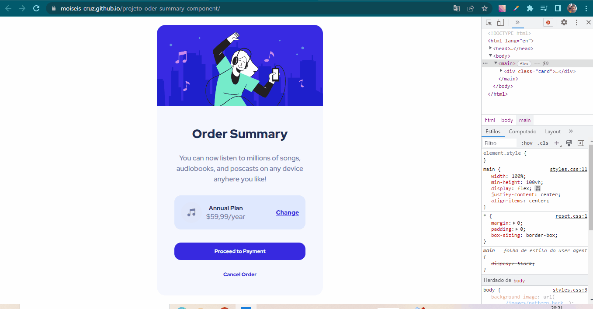

# projeto-oder-summary-component

Este é um pequeno desafio do Frontend Mentor para testar as minhas habilidades. Onde eu mesmo resolvi me desafiar. Coloquei em prática os meus conhecimentos em tecnologias já estudadas.

## Tecnologias usadas:
- HTML;
- CSS;

### Desafios:
O meu desafio maior neste projeto foi a ultilização das tags no HTML, com maior destaque para a divs.

Vejam como ficou... 🚀🚀

